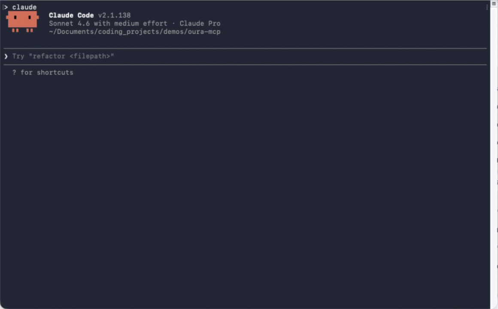

# oura-ring-mcp

> Talk to your Oura Ring data through Claude. Local SQLite mirror, natural-language annotations, and MCP tools for actually asking questions about your health data.

[](https://github.com/FelixWag/oura-ring-mcp/actions/workflows/ci.yml)
[](LICENSE)
[](https://modelcontextprotocol.io)
[](https://github.com/FelixWag/oura-ring-mcp/actions)
[](https://nodejs.org)



I built this because I wanted something more useful than another dashboard.
Oura already captures sleep, readiness, activity, heart rate, stress, and tags.
The missing piece is context: coffee, alcohol, illness, travel, late meals,
hard training, bad sleep hygiene, or whatever else actually happened in life.

`oura-ring-mcp` connects those worlds. It syncs your Oura data into a local
SQLite database, lets an MCP client like Claude Code read it, and lets you log
your own annotations in natural language:

- "I had 2 beers Thursday from 7pm to midnight. Log it."
- "Did my readiness drop after alcohol days?"
- "Compare this week's sleep to last week."
- "What was my heart rate during yesterday's workout?"
- "My energy has been low lately. Anything in the data that explains it?"

Everything is local-first. After sync, most questions answer from your SQLite
mirror instead of repeatedly hitting the Oura API.

> Sensitive data warning: this project works with personal health data. Tokens
> and synced data are stored locally at `~/.config/oura-ring-mcp/` with `0600`
> permissions and are never sent anywhere by this software except to
> `api.ouraring.com` for Oura API requests. Your MCP client may see whatever
> data you ask it to analyze.

## Why It Is Interesting

- **Local mirror of 15 Oura collections**: sleep, readiness, activity, SpO2,
  stress, resilience, cardiovascular age, VO2 max, sleep time, sleep periods,
  workouts, sessions, rest mode periods, enhanced tags, and heart rate.
- **14 MCP tools** for raw reads, recent summaries, comparisons, trends,
  heart-rate windows, annotation CRUD, tag reads, and sync.
- **Natural-language context logging**: store your own local annotations for
  things Oura cannot know.
- **Correlation-friendly shape**: daily summaries can include overlapping
  annotations by default, so an LLM sees metrics and context together.
- **Privacy-first by design**: OAuth tokens and health data stay on your
  machine; the Oura API remains read-only.
- **Built to be hackable**: TypeScript, SQLite, zod validation, Vitest tests,
  and a small codebase.

## Quick Start

You need Node.js 20+ and an Oura account.

### 1. Register an Oura OAuth App

Go to <https://cloud.ouraring.com/oauth/applications> and create a new app.

- Redirect URI: `http://127.0.0.1:8765/callback`
- Privacy Policy URL: `https://github.com/FelixWag/oura-ring-mcp/blob/main/PRIVACY.md`
- Terms of Service URL: `https://github.com/FelixWag/oura-ring-mcp/blob/main/TERMS.md`

Copy the Client ID and Client Secret.

### 2. Clone, Install, Build

```bash
git clone https://github.com/FelixWag/oura-ring-mcp.git
cd oura-ring-mcp
npm install
npm run build
```

### 3. Configure, Authorize, Sync

```bash
npm run init
```

That one command:

1. writes your local `.env`,
2. opens the Oura OAuth login,
3. stores tokens at `~/.config/oura-ring-mcp/tokens.json`,
4. syncs roughly the last 30 days into `~/.config/oura-ring-mcp/data.sqlite`.

Want more history?

```bash
npm run sync -- --since 240
```

Backfills up to 730 days are supported. Larger windows are chunked internally
to respect Oura's API limits.

### 4. Connect Claude Code

```bash
claude mcp add oura node "$(pwd)/dist/index.js"
```

Restart Claude Code, run `/mcp`, and check that `oura` is listed. Then try:

```text
Show me my last 7 days of Oura summaries with annotations.
```

If a sync fails with a scope-related authorization error after upgrading,
run `npm run oauth-login` again. Oura tokens only get new scopes after
re-authorization.

## Example Prompts

**Sleep and recovery**

- "Show me my last 14 days of sleep, readiness, and activity."
- "Which night this month had the worst sleep, and what changed?"
- "How long did it take my resting heart rate to recover after my last alcohol day?"
- "Walk me through last night's sleep periods and heart-rate pattern."

**Trends and comparisons**

- "Compare this week's sleep to the previous week."
- "Show my readiness rolling average over the last 60 days."
- "Compare weekdays vs weekends for sleep score and bedtime."
- "What is my VO2 max trajectory?"

**Logging context**

- "I had 2 beers Thursday from 7pm to midnight. Log it."
- "I was sick from Monday to Wednesday. Log a cold annotation."
- "I had a late coffee today at 4pm. Log it."
- "List all my alcohol annotations from the last 3 months."

**The fun part**

- "Across my alcohol annotations, what usually happens to next-day readiness?"
- "Is there a relationship between caffeine days and deep sleep?"
- "Do hard workout days change my sleep or recovery?"
- "My energy has been low lately. What patterns should I look at?"

## Tools

### Raw Access

| Tool                     | Inputs                                                  | Notes                                                                          |
| ------------------------ | ------------------------------------------------------- | ------------------------------------------------------------------------------ |
| `oura_get_daily_summary` | `start_date`, `end_date`, `verbose?`, `prefer?`         | Merges daily sleep, readiness, and activity. Includes annotations by default.  |
| `oura_get_sleep`         | `start_date`, `end_date`, `verbose?`                    | Detailed sleep-period records.                                                 |
| `oura_get_activity`      | `start_date`, `end_date`, `verbose?`                    | Daily activity rows.                                                           |
| `oura_get_heartrate`     | `start_datetime`, `end_datetime`, `verbose?`, `prefer?` | Local-first heart-rate query. Compact mode returns hourly summaries by source. |
| `oura_get_personal_info` | none                                                    | Basic profile metadata exposed by the Oura API.                                |

### Derived Metrics

| Tool                      | Inputs                              | Notes                                     |
| ------------------------- | ----------------------------------- | ----------------------------------------- |
| `oura_get_recent_summary` | `days` (1-90), `prefer?`            | Convenience wrapper for recent days.      |
| `oura_compare_periods`    | `days` or explicit date ranges      | Period averages, deltas, and direction.   |
| `oura_get_trends`         | `start_date`, `end_date`, `window?` | Rolling averages and simple trend labels. |

### Tags And Annotations

| Tool                     | Inputs                                                  | Notes                                                                   |
| ------------------------ | ------------------------------------------------------- | ----------------------------------------------------------------------- |
| `oura_get_enhanced_tags` | `start_date`, `end_date`, `verbose?`                    | Reads tags logged in the Oura app.                                      |
| `oura_add_annotation`    | Oura-style tag fields                                   | Stores a local annotation in SQLite.                                    |
| `oura_list_annotations`  | `start_date?`, `end_date?`, `tag_type_code?`, `source?` | Lists local annotations and synced Oura tags. Date filters use overlap. |
| `oura_update_annotation` | `id`, partial tag fields                                | Updates a local annotation.                                             |
| `oura_delete_annotation` | `id`                                                    | Deletes a local annotation.                                             |

Local annotations mirror Oura's `EnhancedTagModel` fields:
`tag_type_code`, `custom_name`, `start_time`, `end_time`, `start_day`,
`end_day`, and `comment`, plus `source` and `oura_id` for provenance.

Because the public Oura API is read-only for user data, annotation writes are
local only. This is intentional: it gives the LLM memory for things Oura does
not capture without pretending to write back to Oura.

### Local Mirror

| Tool        | Inputs                                                  | Notes                                                                              |
| ----------- | ------------------------------------------------------- | ---------------------------------------------------------------------------------- |
| `oura_sync` | `since_days?`, `full?`, `tags_only?`, `with_heartrate?` | Pulls Oura data into SQLite. Incremental by default with a 7-day re-fetch overlap. |

Read preference for local-first tools:

- `auto` (default): use local data when available; fetch missing/recent data
  from Oura and upsert it locally.
- `local`: offline mode; only return what is already in SQLite.
- `api`: force a fresh Oura API read and upsert the result locally.

## Configuration

| Variable             | Default                               | Purpose                                      |
| -------------------- | ------------------------------------- | -------------------------------------------- |
| `OURA_CLIENT_ID`     | -                                     | Required. From your Oura OAuth app.          |
| `OURA_CLIENT_SECRET` | -                                     | Required. From your Oura OAuth app.          |
| `OURA_REDIRECT_URI`  | `http://127.0.0.1:8765/callback`      | Must match your Oura app exactly.            |
| `OURA_TOKEN_PATH`    | `~/.config/oura-ring-mcp/tokens.json` | OAuth token file.                            |
| `OURA_DB_PATH`       | `~/.config/oura-ring-mcp/data.sqlite` | SQLite database for synced data/annotations. |
| `OURA_DEBUG`         | unset                                 | Set to `1` for verbose stderr logs.          |

`.env` is loaded from the project root, even when an MCP host starts the
binary from another working directory.

## Development

```bash
npm run dev
npm test
npm run typecheck
npm run format:check
npm run build
```

The project intentionally uses a boring stack: TypeScript, Node.js, the
official MCP SDK, `better-sqlite3`, zod, and Vitest.

## Security

- `.env`, token files, SQLite databases, and SQLite sidecar files are ignored.
- Token and database files are written with `0600` permissions.
- SQL uses prepared statements and parameter binding.
- The MCP server exposes only the documented tools: no shell execution and no
  arbitrary filesystem access.
- The Oura API is read-only for user data. Local annotations write only to
  your local SQLite database.
- This is not a medical device and is not medical advice. It is a personal
  analysis tool for your own data.

## Troubleshooting

**`No saved tokens at ...`**  
Run `npm run oauth-login`.

**`invalid_client` during OAuth**  
Check that `OURA_CLIENT_ID` and `OURA_CLIENT_SECRET` in `.env` match the Oura
application you created.

**`Address already in use :::8765`**  
Change the port in `OURA_REDIRECT_URI`, update the same redirect URI in Oura's
application settings, then run `npm run oauth-login` again.

**Scope-related 401 during sync**  
Run `npm run oauth-login` again so Oura grants the latest scope set.

## Project Notes

The detailed architectural history lives in [DECISIONS.md](DECISIONS.md), and
release notes live in [CHANGELOG.md](CHANGELOG.md). The short version: this is
local-first because health data is sensitive, SQLite because it is simple and
fast, and annotations because context is what turns raw metrics into something
an LLM can actually reason about.

## License

[MIT](LICENSE)
